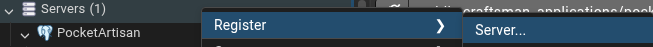
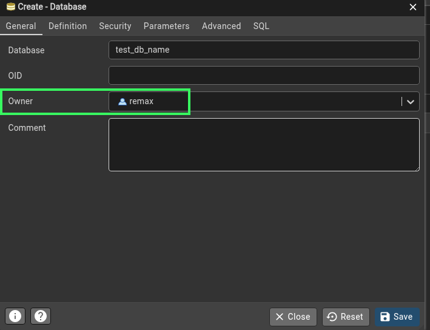

# NOTES

## Running the application

Before you build and run application with `docker compose up --build`
1. create a .env file with these flags set

```
POSTGRES_HOST=postgres
POSTGRES_USER=test_user
POSTGRES_PASSWORD=test_password
POSTGRES_DB=test_db_name
POSTGRES_PORT=5432

REDIS_HOST=redis_cache
REDIS_PORT=6379

APP_PORT=8080
APP_ENV=development

JWT_SECRET=test_jwt_secret

```
2. Create actual DB

- Open pgAdmin4
- Register a new server:

  

- Create the actual database:

  

    Owner is the user whose username and password you are passing in .env


## Testing

- Whenever `docker compose down -v` is executed it is important to run ./app_init.sh from project root to clear go test cache and repopulate database with initial data


## General notes

- In this prototype stage there will be no integraticon with payment Gateway like Payten. Instead mock transaction will be used.

- in `/notes` directory you can see notes which I made for myself when assistet by agents to serve as future reference and study material

